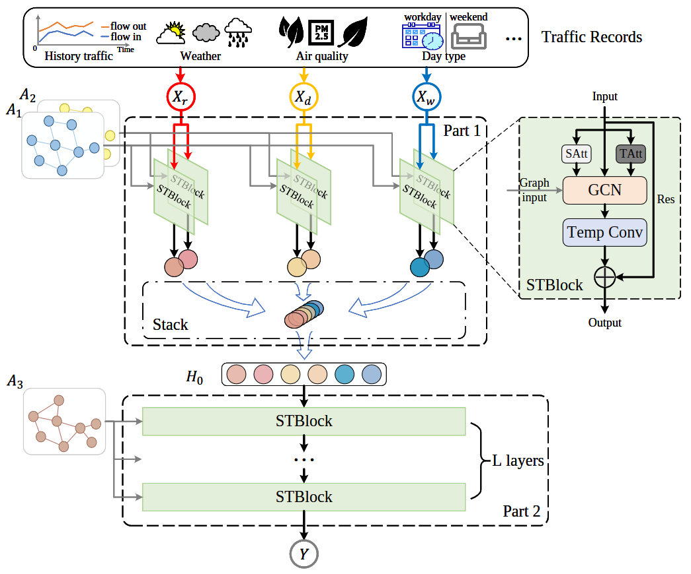

# MISTAGCN

## An overview
MISTAGCN is a novel deep learning model provided in our paper "Multiple Information Spatial-Temporal Attention Based Graph Convolution Network For Traffic Prediction", which is submitted to journal [Applied Soft Computing](https://www.sciencedirect.com/journal/applied-soft-computing) and is currently under reviewed.

This project is implemented in python and based mainly on MXNet framework. The main structure of MISTAGCN is



## Get started

To prepare the development environment,

``` {bash}
pip install -r requirements.txt
```

to train a special model,

``` {bash}
python models/<selected model>/train.py
```

or to train all the models, one by one (corresponding lines should be uncommented first).

``` {bash}
./run.sh
```

## Script process order, eg. Haikou dataset.

* Run 'scripts/haikou_data_extraction_trip_2017.py' to extract travel orders and store them in './data/Haikou/trip-2017.db'.
* Run 'scripts/haikou_flow_aggregation_region_hour.py' to caculate traffic flows of all regions and stored in './data/Haikou/traffic-flows.db'', while filtering regions with no records.
* Run 'scripts/haikou_gen_data_samples.py' to prepare data samples for model trainning, such as Xr_sample, Xd_sample ... The records are stored in './data/Haikou/data-samples'.
* Run 'scripts/haikou_gen_distance_graph.py' to calculate ajacency matrix of distance graph, and store it in 'data/Haikou/adg'.
* Run 'scripts/haikou_gen_correlation_graph.py' to calculate ajacency matrices of correlation graph, and store them in 'data/Haikou/acg'.
* Run 'scripts/haikou_gen_interaction_graph.py' to calculate ajacency matrices of interaction graph, and store them in 'data/Haikou/aig'.

## Important notes

* All of the scripts are supposed to be run under the project's root directory, and the relative directories in each script is from the root directory as well.
* Loss (errors for training)

    L2Loss =$\frac{1}{2} \sum_i (label_i-pred_i)^2$

    L1Loss = $\sum_i \|label_i-pred_i\|$

* Matric (values for evaluation)

    MAE = $\frac{1}{n}\sum_i |y_i - \hat{y}_i|\,\,$  #Mean Absolute Error

    RMSE = $\sqrt{\frac{\sum_i (y_i - \hat{y}_i)^2}{n}}\,\,$  #Root Mean Squred Error
